# eCommerce functionalities UI alternatives

- **Register user functionality**:

    
    
    

- **Profile user functionality**:

    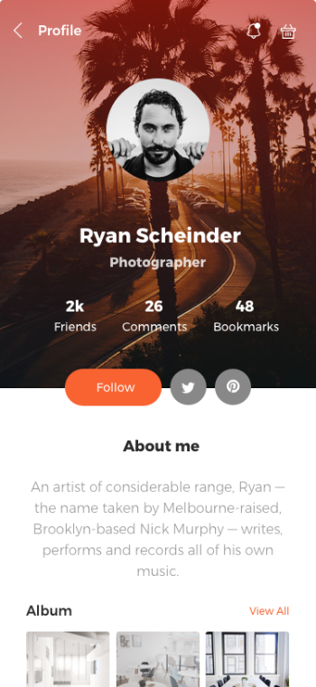
    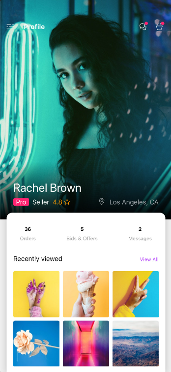
    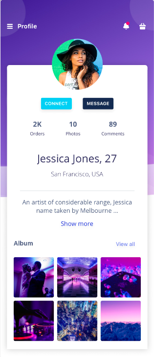

- **Home functionality**:

    
    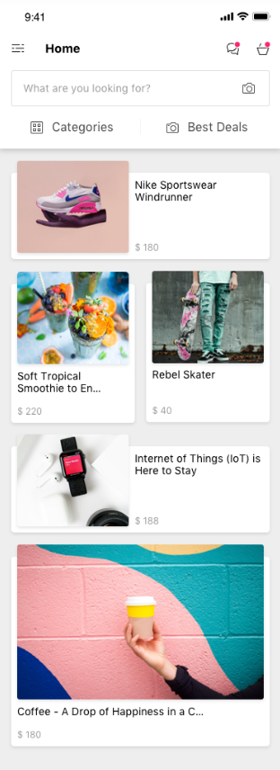
    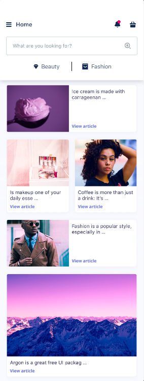

- **Menu functionality**:

    
    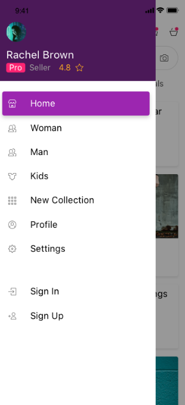
    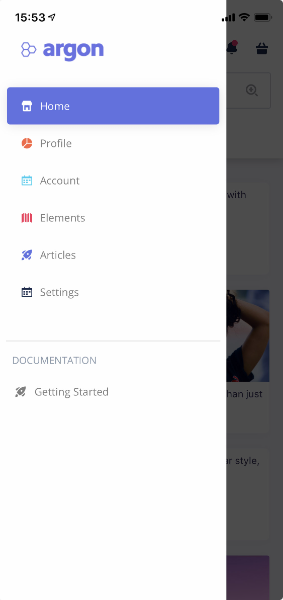

- **Settings functionality**:

    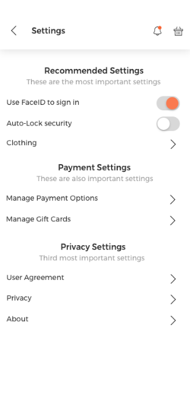
    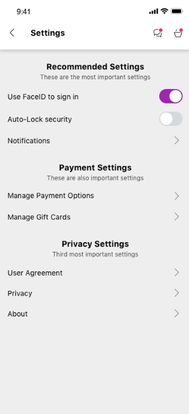
    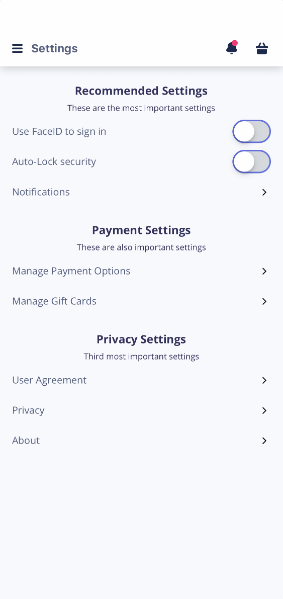

- **System notifications functionality**:

    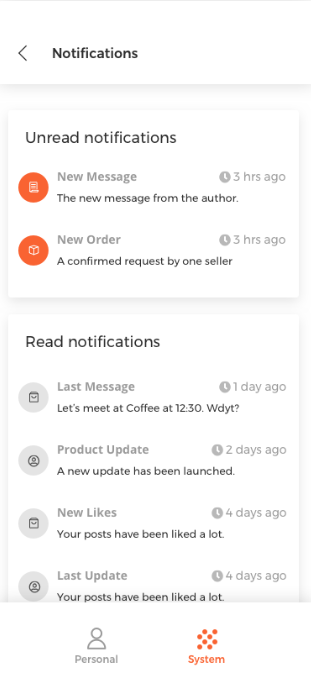
    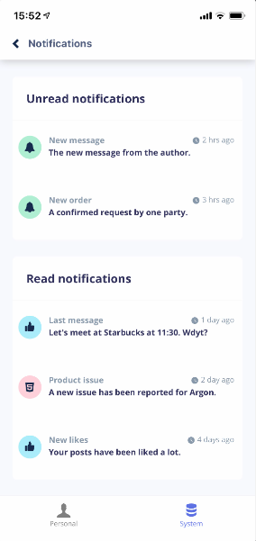

- **Personal notifications functionality**:

    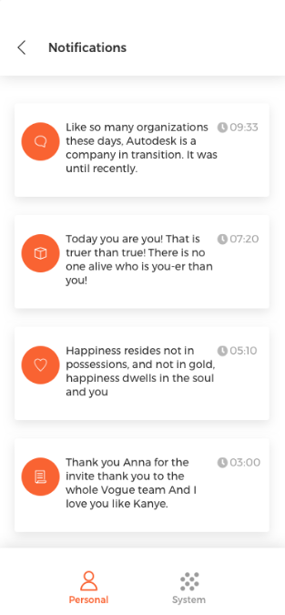
    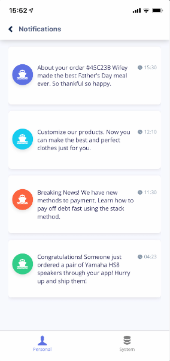

- **Chat functionality**:

    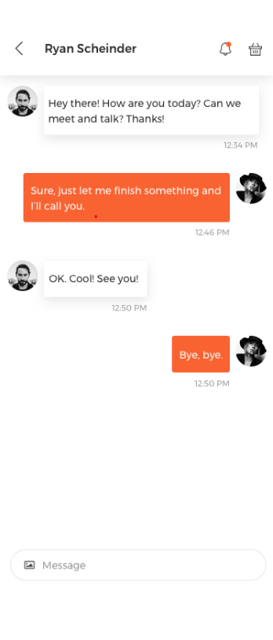
    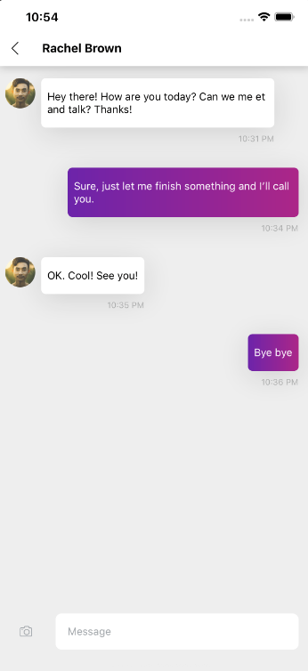
    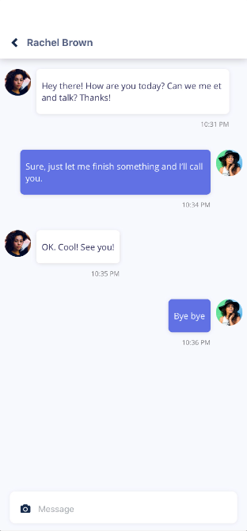

- **Search functionality**:

    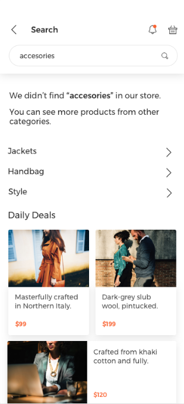
    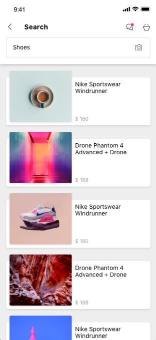
    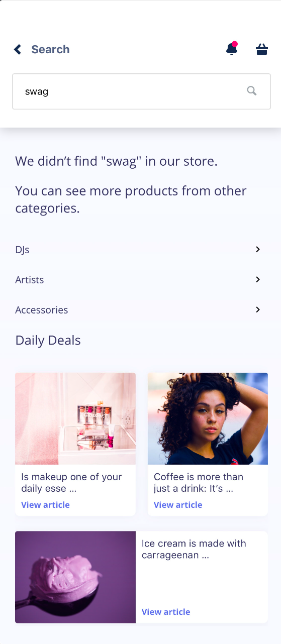

- **Products list functionality**:

    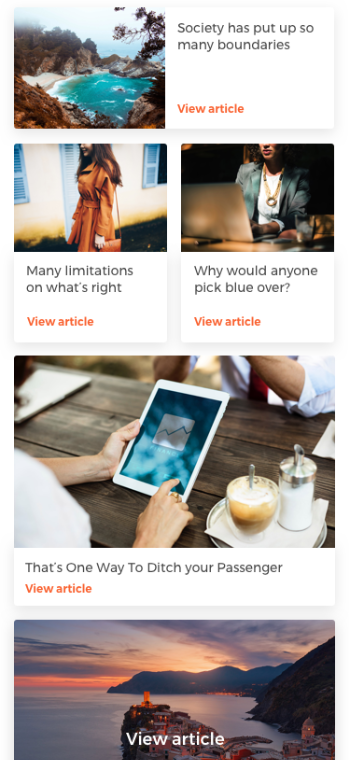
    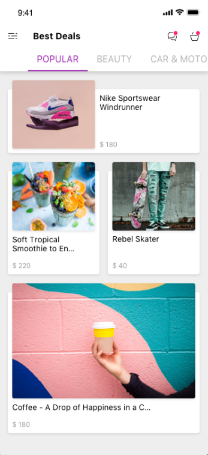
    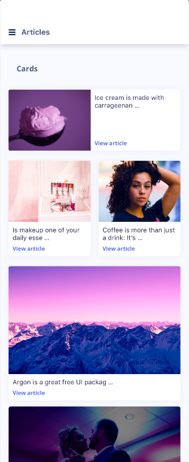

- **Product details functionality**:

    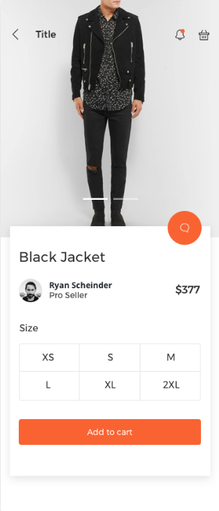
    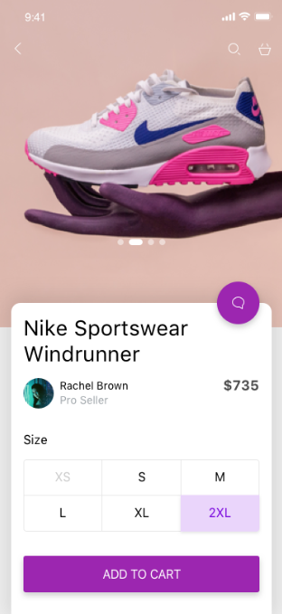
    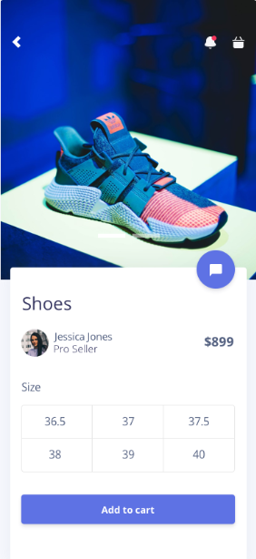

- **Categories list functionality**:

    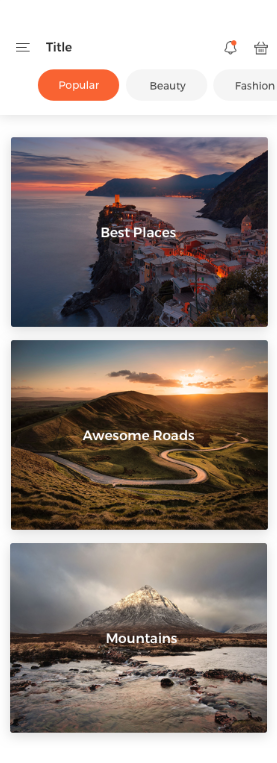
    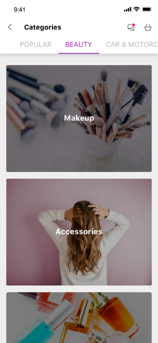
    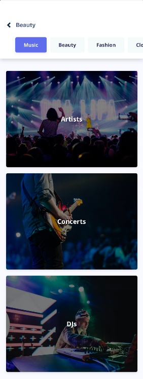

